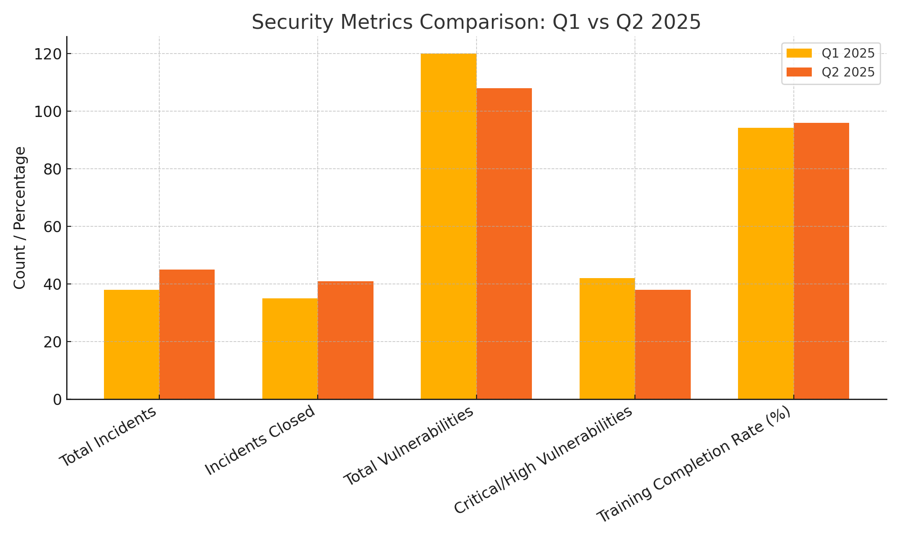

# 📊 Security Metrics Dashboard

This project showcases a structured approach to tracking and reporting key cybersecurity metrics across incident response, vulnerability management, and security awareness training. These metrics help align technical operations with business risk, SLA enforcement, and compliance performance.

---

## 🎯 Objectives

- Track security KPIs to improve visibility and accountability
- Measure team performance against SLAs and baselines
- Provide actionable dashboards for executive reporting

---

## 🧮 Key Metrics Tracked

### 🔐 Incident Response
- Total number of incidents
- Number of incidents closed
- % closed within SLA
- Average resolution time (MTTR)
- Recurrence rate (repeat incidents)

### 🛡️ Vulnerability Management
- Total number of vulnerabilities
- Critical & High vulnerabilities outstanding
- % of vulnerabilities remediated within SLA
- MTTR for Critical/High
- SLA compliance rate

### 📚 Security Awareness
- Training campaign completion rate
- Phishing simulation failure rate
- Department-by-department comparison

---

## 🗂️ Project Structure

- `metrics-samples/` — Excel/CSV files with mock KPI data
- `dashboards/` — Charts, visuals, and presentation snapshots
- `methodology/` — Definitions and how KPIs are calculated
- `reports/` — Sample reports and dashboards formatted for leadership

---

## 📌 Notes

All data shown in this project is mock data created for demonstration and skill showcase purposes. No real company or user information is represented.

---

## 🤝 Contributions & Feedback

Feedback and suggestions are welcome. Feel free to fork, contribute, or use for inspiration in your own metrics program.

---

## 📊 Visual Comparison (Q1 vs Q2 2025) - RESULT

This chart shows key security metrics side-by-side for Q1 and Q2 2025, highlighting trends in incidents, vulnerabilities, and training completion.

- 📘 [Metrics Methodology Definitions](./methodology/metrics-methodology.xlsx)
